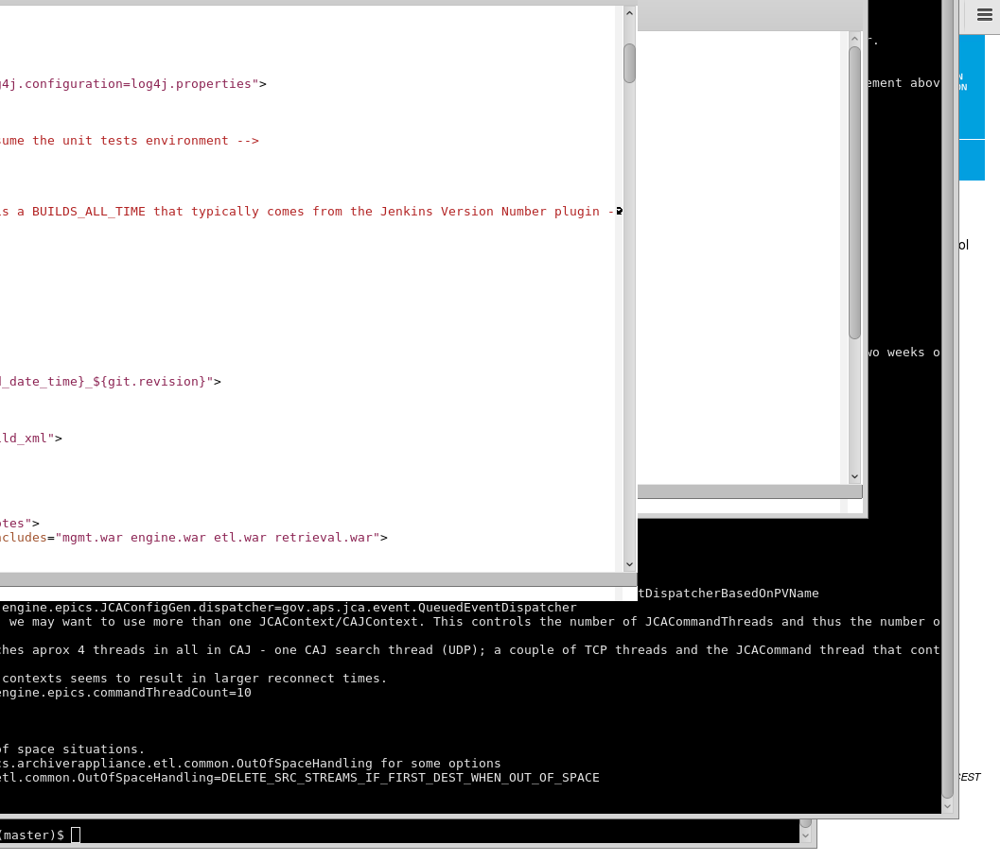

A Site-Specific (ESS) EPICS Archiver Appliance Deployment
=================

# Requirements

* CentOS 7 (Tested with 7.2 1511) 

# License

* All works done by the original Archiver Appliance follows its original Licenses. Please check them in
https://github.com/slacmshankar/epicsarchiverap/blob/master/NOTICE
* Makefile, to build any documents, follows its original License also. Please check it in  http://www.bouncingchairs.net/oss
* In addition, The works in this repository can be distributed under the GPL-2 license.

# Archiver Appliance Setup on CentOS 7

With the following commands, one can setup an Archiver Appliance quite easily on CentOS 7.2

```
$ curl -L https://git.io/vXSN6 -o aa_init.bash
$ bash aa_init.bash 
$ cd epicsarchiverap-sites/
$ bash 00_preAA.bash all
$ bash 01_aaBuild.bash 
$ bash 02_aaSetup.bash 
$ bash 03_aaDeploy.bash
```

# Files

## setEnvAA.bash
* almost all important variables are defined
* E.g., TOMCAT_HOME, EPICS_BASE, ARCHAPPL_TOP, LD_LIBRARY_PATH, and so on... 

## aaInit.bash
* sudo permission is needed.
* Remove the cumbersome package (PackageKit)
* Install pre-required packages (git, epel-release, tree)
* Do git clone the current repository

## 00_preAA.bash
* sudo permission is needed.
* Remove the cumbersome package (PackageKit) 
* Install pre-required packages (git, epel-release, tree)
* Do mkdir local storages (STS, MTS, LTS)
* Install necessary packages for Archappl (ntp, java-1.8.0-openjdk, mariadb, tomcat, etc)
* Install necessary packages for EPICS base (....)
* Start ntpd, mariadb, and tomcate services through systemd
* Install EPICS base
* Setup MariaDB (Secure MySQL Setup)
* Prepare mariadb-connector-j from github.com (Binary can be downloaded with login in MariaDB site)
* (Optional) Replace Gnome with Mate and replace gdm with lightdm
* (Optional) do yum update

## 01_aaBuild.bash
* Download Archappl from https://github.com/slacmshankar/epicsarchiverap
* Select a version
* Build the selected version

## 02_aaSetup.bash
* Prepare the target directories ${SC_DEPLOY_DIR} ${ARCHAPPL_TOP}
* Put log4j.properties in ${TOMCAT_HOME}/lib
* Put appliances.xml in  ${ARCHAPPL_TOP}
* Deploy multiple tomcats into ${ARCHAPPL_TOP}
* Put context.xml in to ${ARCHAPPL_TOP}/mgmt/conf/
* Create DB tables into DB ${DB_NAME}

## 03_aaDeploy.bash
* Deploying a new release from mgmt, engine, etl, retrieval onto ${ARCHAPPL_TOP}"
* Modifying the static contents, images, and css for the ESS site specific information

## aaService.bash
* Service start/stop/restart

# Commands

* Only Command List

```
[aauser@ ]$ curl -L https://git.io/vXSN6 -o aa_init.bash
[aauser@ ]$ bash aa_init.bash 
[aauser@ ]$ cd epicsarchiverap-sites/
[aauser@ epicsarchiverap-sites]$ bash 00_preAA.bash all
[aauser@ epicsarchiverap-sites]$ bash 01_aaBuild.bash 
 0: git src                             master
 1: git src   v0.0.1_SNAPSHOT_03-November-2015
 2: git src        v0.0.1_SNAPSHOT_10-Sep-2015
 3: git src        v0.0.1_SNAPSHOT_12-May-2016
 4: git src        v0.0.1_SNAPSHOT_12-Oct-2016
 5: git src       v0.0.1_SNAPSHOT_20-Sept-2016
 6: git src       v0.0.1_SNAPSHOT_22-June-2016
 7: git src        v0.0.1_SNAPSHOT_23-Sep-2015
 8: git src    v0.0.1_SNAPSHOT_26-January-2016
 9: git src       v0.0.1_SNAPSHOT_29-July-2015
10: git src      v0.0.1_SNAPSHOT_30-March-2016
Select master or one of tags which can be built, followed by [ENTER]:

[aauser@ epicsarchiverap-sites]$ bash 02_aaSetup.bash 
[aauser@ epicsarchiverap-sites]$ bash 03_aaDeploy.bash
[aauser@ epicsarchiverap-sites]$ sudo su
[root@ epicsarchiverap-sites]# bash aaService.bash start
[root@ epicsarchiverap-sites]# bash aaService.bash stop
```

--




```

# Acknowledgement
A special word of thanks goes to Murali Shankar who develops the Archiver Appliance and answers my stupid questions again and again and again.
